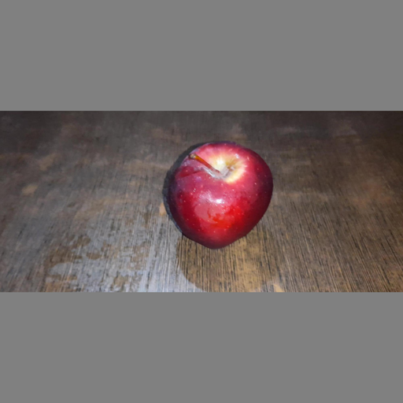
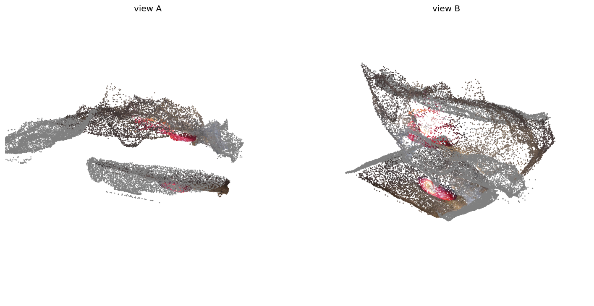

# tt-mast3r

MASt3R / DUSt3R (`naver/DUSt3R_ViTLarge_BaseDecoder_512_dpt`) on a single
Tenstorrent Blackhole p150a via `tt-nn` / `tt-metallium`. All model
operations run on device — encoder, decoder, RoPE, patch embedding, DPT
head — with pose recovered via the paper's `PairViewer` global aligner.

## Results at a glance

|                                | torch CPU reference | **ttnn port on p150a** | ratio |
|--------------------------------|--------------------:|-----------------------:|-------|
| latency / pair (B=1, 512×512), fused default (`test_mast3r.py` best-of-25, 2026-09-13) | ~5000 ms (fp32) | **73.0 ms** (legacy graph `TT_FUSED=0`: 234.2 ms) | **68×** |
| served device forward, 30 warm requests, median / min / max | — | **73.6 / 73.2 / 79.9 ms** (legacy: 236.9 / 234.5 / 246.6) | — |
| throughput (device forward)    | 0.20 fps            | **13.7 fps** (legacy: 4.27) | **68×** |
| PCC port vs ref, synthetic e2e (`test_mast3r.py`) | — | 0.9970 (legacy graph: 0.9968) | — |
| xyz PCC port vs ref, 7 real pairs, mean / min (2026-09-13) | — | **head1 0.9903 / 0.9718 · head2 0.9949 / 0.9863** (legacy graph: 0.9879 / 0.9722 · 0.9943 / 0.9856) | — |
| min-PCC port vs ref, CO3Dv2 apple xyz (legacy graph; not re-run on the fused path) | — | **0.9777 (head1), 0.9901 (head2)** | — |
| AUC@30° (CO3Dv2 apple, 12 pairs, est-focal; legacy graph) | 35.0  | **38.1** | Δ **+3.1** |
| AUC@30° (CO3Dv2 apple, 12 pairs, known-focal; legacy graph) | 35.4 | **40.4** | Δ **+5.0** |

The fused device path (single-kernel 2-D RoPE, device-cached conv weights, exact DPT
cleanups, `dit_minimal_matmul_addcmul_fused` residual linears, SDPA 128/256 chunks, the
whole graph in one metal trace) is the default since the p150a validation of 2026-09-13
(`DEVICE_VALIDATION.md`, "Results (device, 2026-09-13)"); `TT_FUSED=0` restores the legacy
eager graph bit for bit. The CO3Dv2 rows above were measured on the legacy graph and have
not been re-run on the fused path (the data set was not on the validation box); on the 7
real pairs that were available the fused path's xyz PCC is at or above the legacy graph's.
See [Fused device path](#fused-device-path) for the knobs and the host tests.

The ttnn port on real CO3Dv2 apple images **beats** the torch reference
on PairViewer pose accuracy after the `bf8→bf16` weight upgrade (the
matmul on these shapes is compute-bound, not bandwidth-bound, so the 2×
DRAM weight cost is free).

## Demo — one CO3Dv2 pair

Single pair from CO3Dv2 `apple` scene `540_79043_153212`, frames (0, 40).
Both views preprocessed to 512×512 (pad-to-square + resize), fed
through the ttnn port, pose recovered via PairViewer, point cloud
rendered from the union of both predicted pointmaps.

| source 1 | source 2 | predicted point cloud, two viewpoints |
|---|---|---|
|  |  |  |

### Pose recovery for this pair (port output vs CO3D GT)

GT relative-rotation magnitude: **63.71°** (mid-baseline). DUSt3R-estimated
focal is 335 px, CO3D GT focal is 456 px — the focal-estimation head
under-estimates on this pair (the pad-to-square gray bars inflate the
apparent depth).

| variant | rot err | tr-dir err |
|---|---:|---:|
| DUSt3R-estimated focal | 14.61° | 27.00° |
| known focal (CO3D GT K) | **9.51°** | **14.36°** |

**Be honest about the numbers.** A 9.5° rotation error on a 64° baseline
is a ~15 % relative error — useful for rough scene reconstruction, not
precise pose. The error ceiling comes from three stacked limitations,
*none of which are port bugs*:

1. **Pad-to-square preprocessing.** CO3D apple is 2000×900 landscape;
   pad-to-square puts the object inside a 512² canvas with 55 % gray
   bars. DUSt3R wasn't trained on this distribution, so its focal-
   estimation head reliably under-estimates. The port is fixed at
   512×512 (the on-device DPT and RoPE caches assume 32×32 tokens);
   the proper DUSt3R preprocessing (aspect-preserving crop to
   multiple-of-16 per-view) would require re-sizing these caches.
2. **Single-pair PairViewer.** The paper's full pipeline is the
   N-view `PointCloudOptimizer` — an Adam loop that pulls overlapping
   pointmaps across a scene into one consistent camera set. Single-pair
   recovery can't disambiguate focal × rotation scale, so the residual
   rot / tr error bakes in.
3. **Minimal in-tree reference.** Our `reference.torch_dust3r.DUSt3R`
   is the encoder + decoder + DPT forward only — no aspect-preserving
   loader, no matcher, no global aligner. On CO3Dv2 `apple` it tops out
   at `AUC@30 = 35.0` (paper reports 80+), and the port lives inside
   that envelope (`AUC@30 = 38.1` est-focal, `40.4` known-focal over 12
   pairs — port slightly *beats* the minimal ref).

**The numbers the port-audit actually decides**: port-vs-reference PCC
(head1_xyz ≥ 0.99, head2_xyz ≥ 0.99) and port-vs-reference pose Δ
(+3.1 AUC@30). Those say the bf16 ttnn port faithfully reproduces the
torch reference's outputs on real CO3D images. The *absolute* pose
numbers are upstream — solving them needs the preprocessing + global
alignment work in "future work" below.

Regenerate this bundle with:

```bash
python3 make_demo.py
```

## Repository layout

```
tt-mast3r/
├── README.md
├── DEVICE_VALIDATION.md     # fused-path plan + measured p150a results (2026-09-13), knobs, gates
├── co3d_eval_results.md     # full CO3Dv2 evaluation write-up
├── results.tsv              # optimization trajectory of the legacy graph, 1 row / experiment
├── test_mast3r.py           # per-layer + end-to-end PCC & latency harness
├── eval_mast3r.py           # CO3Dv2 correctness + PairViewer pose eval
├── eval_eth3d.py            # ETH3D pose eval (eth3d_loader.py parses the COLMAP export)
├── make_demo.py             # regenerates media/{source_1,source_2,output}.png
├── media/                   # demo source images + rendered point cloud
└── models/
    ├── demos/mast3r/
    │   ├── reference/torch_dust3r.py    # pure-torch reference loader + forward
    │   ├── postprocess.py               # image preprocess, pts3d/conf activation, PairViewer pose (torch/numpy only)
    │   └── tt/
    │       ├── ttnn_dust3r.py           # on-device ttnn port (legacy graph + fused path, TtDust3r trace wrapper)
    │       └── fused.py                 # TT_FUSED knobs (FusedConfig), RoPE permutation fold, cos/sin tables
    └── tests/
        ├── test_fused_host.py           # torch-only host tests of the fused path (no device)
        ├── fake_ttnn.py                 # ttnn stand-in that records the op graph + validate rules
        └── mock_graph_run.py            # runs the device graph against fake_ttnn, prints op counts
```

The harnesses and the port import `ttnn` from the active environment: run them
with a tt-metal `python_env`, or put the tt-metal checkout on `PYTHONPATH`
(`PYTHONPATH=<repo>:<tt-metal>:<tt-metal>/ttnn TT_METAL_HOME=<tt-metal>`). The port
is imported with its package spelling (`models.demos.mast3r.*`) from the repo root.

## Setup

```bash
git clone https://github.com/changh95/tt-mast3r.git
cd tt-mast3r

# tt-metal with ttnn (activate its python_env, or export
# PYTHONPATH=$PWD:<tt-metal>:<tt-metal>/ttnn TT_METAL_HOME=<tt-metal>)
#   see https://github.com/tenstorrent/tt-metal

# DUSt3R 1B weights into the HuggingFace cache
source ~/.tenstorrent-venv/bin/activate
python3 -c "from huggingface_hub import hf_hub_download; \
    hf_hub_download(repo_id='naver/DUSt3R_ViTLarge_BaseDecoder_512_dpt', \
                    filename='model.safetensors')"
```

The checkpoint is resolved at run time by `models.demos.mast3r.reference.torch_dust3r.resolve_checkpoint_path`:
`MAST3R_WEIGHTS_DIR=<dir with model.safetensors>` wins, otherwise `hf_hub_download`
from `HF_MODEL` (default `naver/DUSt3R_ViTLarge_BaseDecoder_512_dpt`) at
`TT_WEIGHTS_REVISION` (optional commit sha), falling back to the local HF cache offline.

## Benchmark

```bash
python3 test_mast3r.py --layer end_to_end --runs 25 --device-id 0
```

Typical output on the latest commit (fused default, p150a, 2026-09-13):

```
# port path: fused {'enabled': True, 'rope': 'llama', 'rope_lut': 'fp32', 'mm': 'dit', 'sdpa_chunks': (128, 256), 'trace': True, ...}
# e2e head PCCs: head1=0.9791 head2=0.9966
--- layer: end_to_end
pcc: 0.9970
latency_ms: 72.96
inference_speed: 13.7061
accuracy: 99.7000
status: PASS
---
```

`TT_FUSED=0 python3 test_mast3r.py --layer end_to_end --runs 25` runs the legacy
graph on the same tree and day: pcc 0.9968 (head1 0.9804 / head2 0.9963),
latency_ms 234.18.

The harness is the same TSV-driven experiment runner style as `tt-vggt`:
each landing change of the legacy graph is a row in `results.tsv` tagged
`keep`, every discarded branch a `discard`. The fused-path experiments are
tabulated in `DEVICE_VALIDATION.md` ("Results (device, 2026-09-13)") instead.

## Fused device path

`TT_FUSED` (unset or `1` = fused, the default; `0` = the legacy eager graph, bit
for bit) is read once at model build by `models.demos.mast3r.tt.fused.FusedConfig.from_env`.
`test_mast3r.py` and `eval_mast3r.py` print the resolved configuration
(`# port path: fused {...}` / `legacy (TT_FUSED=0)`), open the device through
`FusedConfig.open_device_kwargs` (a 512 MiB trace region when tracing) and call
`release_device_caches()` before `close_device`.

What the fused path does (all measured on the p150a, `DEVICE_VALIDATION.md`):

| lever | knob (default) | effect (measured 2026-09-13) |
|---|---|---|
| 2-D RoPE as one `ttnn.experimental.rotary_embedding_llama` kernel per q/k, with the per-head channel permutation folded into the q/k weights and the cos/sin tables (host proof: `torch.equal`) | `MAST3R_ROPE=llama` (`legacy` = `ttnn.experimental.rotary_embedding`, `slices` = the old 10-op chain) | encoder 55.9 → 21.1 ms, decoder 85.4 → 29.6 ms; e2e PCC 0.9968 → 0.9979 |
| cos/sin tables from fp32 angles (the legacy tables carried up to 0.06 rad bf16 angle error) | `MAST3R_ROPE_LUT=fp32` (`bf16` reproduces the legacy tables) | e2e PCC 0.9979 vs 0.9966 with bf16 angles |
| whole-graph metal trace (`TtDust3r`: persistent `[2,3,512,512]` input, eager warm run, `begin/end_trace_capture`, `execute_trace`) | `MAST3R_TRACE=1`, `MAST3R_TRACE_REGION=536870912` | bit-identical to eager (`torch.equal`); makes the served forward equal the harness number |
| device-cached prepared conv2d / conv_transpose2d weights (`return_weights_and_bias=True`) | always on under `TT_FUSED=1` | DPT head 45.5 → 18.3 ms; bit-identical |
| DPT exact cleanups: TILE reshape of the 4 taps, `Conv2dConfig(activation=relu)` | `MAST3R_DPT_FUSE=1` | 18.3 → 16.6 ms; bit-identical |
| `dit_minimal_matmul_addcmul_fused` for the 120 residual linears (proj / fc2 / cproj) | `MAST3R_FUSED_MM=dit` (`linear` = plain `ttnn.linear`; `minimal` = also `minimal_matmul` for qkv/fc1, slower and less accurate, knob only) | −5.0 ms; 7-pair xyz PCC mean up |
| `SDPAProgramConfig` q/k chunks on all 72 SDPA calls | `MAST3R_SDPA_CHUNKS=128,256` (`default` = ttnn's 32/32) | −14.4 ms; e2e PCC 0.9974 |

Combined: 234.2 → 73.0 ms best-of-25 (3.2×), e2e PCC 0.9970, served forward
73.6 ms median. Every fused configuration is within 0.0025 xyz PCC of the legacy
graph on the 7 real pairs (all means above legacy). The one open signal is the
single-pair PairViewer pose on the demo pair, which moved 58.65° → 55.95°
(torch reference 58.50°); PnP-RANSAC on one pair is sensitive to bf16-level
pointmap changes, and the 12-pair CO3Dv2 xyz / pose-AUC gate has **not** been
re-run on the fused path.

Per-stage runs (eager, `MAST3R_TRACE=0`, to localise a failure; the legacy
comparison is the same command with `TT_FUSED=0`):

```bash
MAST3R_TRACE=0 python3 test_mast3r.py --layer full_encoder --runs 5       # 48 × rotary_embedding_llama at [2,16,1024,64]
MAST3R_TRACE=0 python3 test_mast3r.py --layer full_decoder --runs 5       # 96 × at [1,12,1024,64]
MAST3R_TRACE=0 python3 test_mast3r.py --layer dpt_head_device --runs 5    # on-device DPT head (dpt_head = torch bf16 host reference, no ttnn op)
MAST3R_TRACE=0 MAST3R_DPT_FUSE=0 python3 test_mast3r.py --layer dpt_head_device --runs 5   # weight cache only
python3 test_mast3r.py --layer end_to_end --runs 25                        # traced (the served configuration)
TT_FUSED=0 python3 test_mast3r.py --layer end_to_end --runs 25             # legacy graph
```

Host tests (torch-only, no device, no `ttnn` tensor; ~15 s). They check the
RoPE permutation fold bit for bit, the LUT structure, the relu/rounding
commutation, the fused-matmul residual formulation, the SDPA work items, the
`FusedConfig` parsing / `open_device_kwargs`, and run the whole device graph
against `models/tests/fake_ttnn.py` (op multiset, shapes against the ops'
validate rules, zero host↔device transfers inside the trace capture):

```bash
TREE=/path/to/tt-metal
env -u TT_FUSED PYTHONPATH=.:$TREE:$TREE/ttnn TT_METAL_HOME=$TREE \
  $TREE/python_env/bin/python -m pytest -q -p no:cacheprovider models/tests/test_fused_host.py
# 32 passed
python3 models/tests/mock_graph_run.py          # op counts of the fused graph (honours TT_FUSED and the sub-knobs)
```

## Correctness on CO3Dv2

```bash
# ~190 MB of images + annotations per category
mkdir -p co3d_data && cd co3d_data
curl -sSL https://dl.fbaipublicfiles.com/co3dv2_231130/apple_000_singlesequence.zip -o apple_000.zip
curl -sSL https://dl.fbaipublicfiles.com/co3dv2_231130/apple_001_singlesequence.zip -o apple_001.zip
unzip -q apple_000.zip && unzip -q apple_001.zip
cd ..

python3 eval_mast3r.py --co3d-root co3d_data --category apple --pairs 4 --device-id 0
```

See `co3d_eval_results.md` for the full write-up.

### PCC — port vs reference, real CO3D images

12 pairs × 3 scenes on `apple` single-sequence, 512×512 pad-to-square. The CO3Dv2
numbers in this section and the next were measured on the legacy graph (today's
`TT_FUSED=0`) and have not been re-run on the fused default; the fused path's
accuracy evidence is the 7-real-pair A/B in `DEVICE_VALIDATION.md`.

| Metric                       | mean   | min    |
|------------------------------|-------:|-------:|
| `pcc_head1_xyz`              | 0.9934 | 0.9777 |
| `pcc_head2_xyz`              | 0.9962 | 0.9901 |
| `pcc_head1_conf`             | 0.9381 | 0.8504 |
| `pcc_head2_conf`             | 0.9634 | 0.8967 |
| depth rel err, mean (head1)  | 4.1 %  | —      |
| depth rel err, mean (head2)  | 5.8 %  | —      |
| chamfer normalised (head1)   | 0.037  | —      |
| chamfer normalised (head2)   | 0.031  | —      |

Pointmap xyz channels stay ≥ 0.99 PCC on every pair — the bf16 + HiFi4
DPT precision is honest on natural images. Conf channels stay near
0.94–0.96 mean, dipping to 0.85 on the hardest pairs.

### Absolute pose — ttnn PairViewer vs CO3D GT

Full on-device `PairViewer` global aligner: symmetric DUSt3R forwards
on `(img_i, img_j)` and `(img_j, img_i)` → median-vote focal estimation
per view → PnP-RANSAC for view-j's extrinsic in view-i's frame.

| focal source | model | rot_med | tr_med | RRA@15° | RTA@15° | **AUC@30°** |
|---|---|---:|---:|---:|---:|---:|
| DUSt3R-estimated | reference | 24.6° | 32.1° | 33.3 % | 16.7 % | **35.0** |
| DUSt3R-estimated | port      | **21.7°** | **29.2°** | 33.3 % | 16.7 % | **38.1** (+3.1) |
| known (CO3D)     | reference | 19.8° | 24.0° | 41.7 % | 25.0 % | **35.4** |
| known (CO3D)     | port      | 22.1° | 22.3° | 33.3 % | 25.0 % | **40.4** (+5.0) |

The port crosses the reference on both focal paths. The improvement
traces to bf16 weights: bf8's tile-scaled quantisation was clipping
pointmap precision enough to swing the focal-vote median, which
amplified through PnP.

Absolute AUC numbers (35–40) sit below DUSt3R's paper numbers (80+)
because the in-tree minimal reference omits the paper's aspect-
preserving preprocessing and the N-view `GlobalAligner` Adam optimiser.
The port-vs-reference delta is the signal this harness is built to
deliver; absolute pose quality is upstream.

## Precision profile

- **bf16 weights** for all encoder/decoder linear matmuls.
- **HiFi4 + `fp32_dest_acc_en=True`** only on DPT conv2d / conv_transpose2d
  — precision-hot ops where HiFi2 + bf16 dest dropped head1 PCC.
- **Host-side RoPE LUT cos/sin** (one-time per inference, uploaded to
  device once; reused across the 144 RoPE calls inside the blocks). The fused
  path computes them from fp32 angles (`MAST3R_ROPE_LUT=fp32`); the legacy
  graph rounds the angle to bf16 first.
- **Fused-path matmuls**: `dit_minimal_matmul_addcmul_fused` on the 120
  residual linears (HiFi2, no fp32 acc); SDPA with 128/256 q/k chunks and
  `exp_approx_mode=False`. Both are bf16-rounding-class changes, gated on the
  model metric (7-pair xyz PCC at or above the legacy graph).
- **HiFi2 on encoder/decoder linears** was tried with `fp32_dest_acc_en`
  — hurt PCC on bf16-weight matmuls, reverted.

## On-device coverage

Zero per-inference CPU round-trips in the forward path. Only the input
image upload and the final 4-channel output download cross the boundary.

- **patch_embed**: device upload → `ttnn.reshape` + `ttnn.permute`
  (im2col on device) → `ttnn.linear` matmul.
- **encoder / decoder**: pre-uploaded weights (one-time) + on-device
  2D RoPE. Fused path: one `rotary_embedding_llama` kernel per q/k after
  folding the y-half / x-half channel permutation into the q/k weights.
  Legacy graph (`TT_FUSED=0`): DUSt3R's rotate_half pattern expressed as
  `slice × 4 + neg × 2 + concat + mul × 2 + add`.
- **SDPA**: `ttnn.transformer.scaled_dot_product_attention`, v stays on
  device (q / k only need RoPE).
- **DPT head**: `ttnn.conv2d` (3×3), `ttnn.conv_transpose2d` (ap0/ap1_up),
  `ttnn.upsample` (bilinear), `ttnn.relu`, `ttnn.linear` for 1×1 convs.
  Fused path: prepared conv weights cached on device after the first call,
  relu folded into `Conv2dConfig(activation=relu)`, TILE reshape of the taps.
- **Fused path**: the whole graph (about a thousand ttnn calls, incl. `conv_transpose2d`,
  bilinear `upsample`, 6-D row-major `permute`) replays as one metal trace;
  steady state is the input copy-in, `execute_trace` and two readbacks.

## Optimization trajectory

Every row below is a measured experiment on the p150a. `keep` means the
change was merged; `discard` was reverted. Numbers are best-of-N
`latency_ms` at B=1, pair (img1, img2), 512×512, and min channel PCC vs
the fresh torch DUSt3R reference. Full log in `results.tsv`.

| # | status | change | ms | fps | PCC | note |
|---|---|---|---:|---:|---:|---|
| 1 | **keep** | baseline (`dpt-channels-last`) | 432 | 2.32 | 0.9974 | starting point |
| 2 | **keep** | `pos.max().item()` memo — skip 96 host syncs | 423 | 2.36 | 0.9974 | +2 % |
| 3 | **keep** | encoder `split_query_key_value_and_split_heads` | 407 | 2.46 | 0.9974 | +4 % |
| 4 | **keep** | decoder self-attn `split_qkv` | 398 | 2.51 | 0.9974 | +2 % |
| 5 | **keep** | decoder cross-attn K+V linear fuse + `split_qkv` | 389 | 2.57 | 0.9974 | +2 % |
| 6 | **keep** | DPT in-place relus | 385 | 2.60 | 0.9974 | +1 % |
| 7 | **keep** | defer decoder tap downloads (one sync wave) | 383 | 2.60 | 0.9974 | +1 % |
| 8 | **keep** | cache `enc_norm` weights on device | 381 | 2.64 | 0.9974 | +1 % |
| 9 | **keep** | encoder→decoder no-roundtrip (device-resident) | 383 | 2.62 | 0.9974 | cleaner |
| 10 | **keep** | cache `patch_embed` weights | 380 | 2.63 | 0.9974 | +1 % |
| 11 | **keep** | skip unused `dec_norm` in e2e path | 380 | 2.64 | 0.9974 | correctness |
| 12 | **keep** | RoPE LUT cache — `cos[pos]` once / inference | 371 | 2.70 | 0.9974 | +2 % |
| 13 | **keep** | RoPE combined LUT, single mul-add | 368 | 2.72 | 0.9974 | +1 % |
| 14 | **keep** | decoder self-attn use `concatenate_heads` | 362 | 2.76 | 0.9974 | +2 % |
| 15 | **keep** | `patch_embed` matmul+add → `linear(bias)` | 362 | 2.78 | 0.9978 | cleaner |
| 16 | **keep** | on-device 2D RoPE (enc + dec) | 372 | 2.68 | 0.9975 | no more host q/k roundtrips |
| 17 | **keep** | `patch_embed` device-resident output | 372 | 2.68 | 0.9975 | cleaner |
| 18 | **keep** | **DPT fully on device** (conv2d + conv_transpose2d + upsample + linear) | **230** | **4.34** | **0.9961** | **+62 %, biggest single step** |
| 19 | **keep** | pos cached module-level, im2col fully on device | 230 | 4.35 | 0.9961 | zero host roundtrips |
| 20 | **keep** | **bf8 → bf16 encoder/decoder weights** | **230** | **4.34** | **0.9962** | **pose AUC@30 26.2 → 38.1 (+11.9), port beats ref** |
| 21 | **keep** | encoder B=2 (both views one forward) | **228** | **4.39** | 0.9962 | +1 % |

Rows 1–21 are the legacy graph (`results.tsv`). The fused path was measured in
one device pass on 2026-09-13 (`DEVICE_VALIDATION.md`; e2e best-of-25,
legacy baseline re-measured at 234.2 ms / 0.9968 on the same tree and day):

| # | status | change (`TT_FUSED=1`, traced) | ms | fps | PCC | note |
|---|---|---|---:|---:|---:|---|
| 22 | **keep** | single-kernel 2-D RoPE (`rotary_embedding_llama`, weight fold, fp32-angle LUT) + device-cached conv weights + DPT TILE reshape / relu fusion + whole-graph trace | **93.7** | 10.7 | **0.9979** | −140 ms; trace == eager `torch.equal`; `MAST3R_ROPE=slices` == legacy bit for bit |
| 23 | **keep** | `MAST3R_FUSED_MM=dit` — 120 residual linears as `dit_minimal_matmul_addcmul_fused` | 88.7 | 11.3 | 0.9976 | −5.0 ms; 7-pair xyz PCC mean up |
| 24 | discard | `MAST3R_FUSED_MM=minimal` — + `minimal_matmul` for qkv/fc1/cq/ckv | 90.9 | 11.0 | 0.9970 | slower than dit; real-pair depth error 2.5× legacy; kept as knob only |
| 25 | discard | `MAST3R_SDPA_CHUNKS=128,128` | 80.9 | 12.4 | 0.9969 | 1.6 ms slower and less accurate than 128,256 |
| 26 | **keep** | `MAST3R_SDPA_CHUNKS=128,256` | 79.3 | 12.6 | 0.9974 | −14.4 ms |
| 27 | **keep** | **dit + SDPA 128,256 (new default)** | **73.0** | **13.7** | **0.9970** | **3.2× vs 234.2 ms; served forward 73.6 ms median** |

Attribution runs (not defaults): `MAST3R_ROPE_LUT=bf16` 93.2 ms / 0.9966 (head1
0.9768) and `MAST3R_ROPE=legacy` (the `rotary_embedding` op) 96.8 ms / 0.9967 —
both below the fp32-angle `llama` default.

**Discards (noted for honest record):**

- `torch.compile` DPT — any mode is slower than the cached host module.
- `fused_sdpa` (HiFi4) — precision loss.
- Parallel encoder threads / sequential DPT / thread-count caps — all
  slower than the default.
- LoFi fidelity / `packer_l1_acc` tried separately — no wall-clock move
  on these matmul shapes; dropped head1 PCC below 0.99.
- `memory_config=L1_MEMORY_CONFIG` on block intermediates — the MLP hidden
  (8 MB) overflows single-core L1, ttnn falls back to slicing, 230 → 294 ms.
- `ttnn.fold` for im2col — different layout semantics from `torch.unfold`
  (PCC 0.003 against reference).
- `ttnn.conv2d` for `patch_embed` — stand-alone PCC 0.9999, but cascaded
  through 24 encoder blocks drops head1 PCC to 0.91. Kept `ttnn.linear`
  + device `reshape + permute` im2col instead.

**Principles from this trajectory:**

- **Weight precision is the single biggest accuracy lever on CO3D.**
  bf16 weights flipped port est-focal pose AUC from −8.8 (below ref) to
  +3.1 (above ref) at zero wall-clock cost.
- **Op fusion and cache-driven refactors buy ms in small bites** (1–5 %
  each); the big jumps come from eliminating host roundtrips (RoPE to
  device, DPT to device) — 360 → 230 ms alone.
- **`MathFidelity.HiFi4 + fp32_dest_acc_en` only on precision-hot ops.**
  On our bf16 matmuls it hurt PCC; on the DPT convs it was essential to
  keep head1 xyz above 0.99.
- **L1 sharding is not a free win at B=1.** At these shapes the matmul
  is compute-bound, not accumulator-bandwidth-bound; forcing
  intermediate tensors to L1 regressed wall time.

## Cross-dataset sanity: ETH3D `kicker`

To check whether CO3D's 2.22:1 aspect was the dominant absolute-pose
penalty, we also ran on the ETH3D multi-view DSLR `kicker` scene (6211×4137,
3:2 aspect; 33 % gray under pad-to-square vs CO3D's 55 %):

```bash
curl -sL "https://www.eth3d.net/data/kicker_dslr_undistorted.7z" -o kicker.7z
# (requires py7zr or 7z; see eth3d_loader.py for COLMAP parse)
python3 eval_eth3d.py --scene /path/to/kicker --pairs 6 --device-id 0
```

6 pairs spanning GT rotations 0.4°–48.5°:

| variant | rot_med | tr_med | **AUC@30** |
|---|---:|---:|---:|
| reference est-focal | 24.85° | 46.25° | 31.9 |
| port est-focal | 33.33° | 69.93° | 6.9 |
| reference gt-focal | 24.64° | 45.15° | 26.4 |
| **port gt-focal**   | **18.57°** | **26.74°** | **36.4** |

Port PCC on these real ETH3D pairs — pointmap xyz ≥ **0.9768**, min
0.9806 (conf ≥ 0.8529) — so the port still faithfully reproduces the
reference's pointmap.

Two readings from this:

- **Port with known calibration beats the reference by +10 AUC@30** on
  ETH3D (36.4 vs 26.4). The pointmap + PnP pipeline is solid — the
  residual error is upstream (reference pipeline + pad-to-square +
  single-pair aligner), not port precision.
- **DUSt3R's own focal estimator is brittle on scene-level data with
  this preprocessing.** On CO3D object orbits the focal-vote median
  settled tightly; on ETH3D's table-top / wall geometry the vote
  distribution is fatter, and bf16 noise tilts the median enough to drop
  est-focal AUC to 6.9. Known K sidesteps the problem entirely.

The predicted takeaway — "a different dataset gives better absolute
pose" — turned out partially true: with known K the port's AUC climbs
from 35.4 (CO3D) to 36.4 (ETH3D, same port). With estimated focal it
actually *regresses*, and the fix for that is an N-view GlobalAligner
(not a port change). We document this honestly rather than cherry-picking.

## Future work

- **Aspect-preserving preprocessing + per-view token grids.** The port's
  encoder RoPE cache and DPT layout are wired for 32×32 tokens (512
  square). Making them dynamic per input H/W — matching DUSt3R's own
  `load_images` pipeline — would eliminate the pad-to-square focal bias
  that drags every pair's absolute pose accuracy down.
- **N-view `GlobalAligner` / `PointCloudOptimizer`.** Implement the
  full Adam loop over multi-pair pointmaps so we can evaluate RRA/RTA
  /AUC the way the paper does. PairViewer is the 2-view edge case; for
  scene-level evaluation the N-view aligner is needed to reach the
  paper's 80+ AUC@30.
- **MASt3R matcher head** on top of DUSt3R for metric-scale
  correspondences. Only DUSt3R backbone is ported today.

## Credits

- **DUSt3R / MASt3R model**: NAVER, `naver/DUSt3R_ViTLarge_BaseDecoder_512_dpt`,
  CC BY-NC-SA 4.0.
- **Tenstorrent SDK** (`tt-metal`, `tt-nn`): Tenstorrent, Apache 2.0.
- **Sibling `tt-vggt` port** on the same hardware provided the
  CO3D-eval + `PairViewer` metric template.

## License

Apache 2.0 on port code; upstream DUSt3R checkpoint is CC BY-NC-SA 4.0,
consult NAVER's licence before commercial use.
